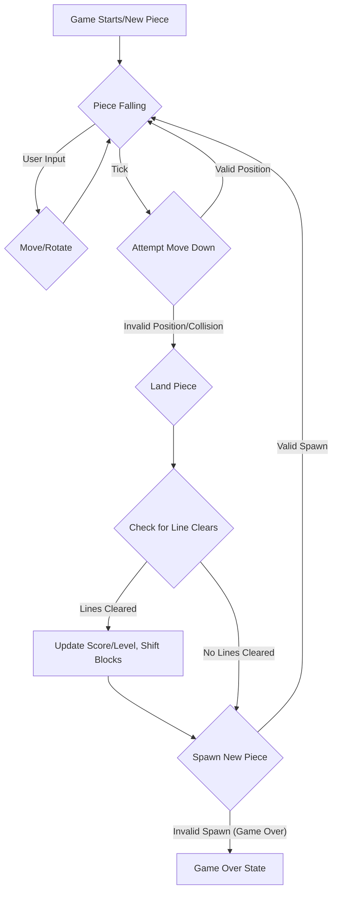
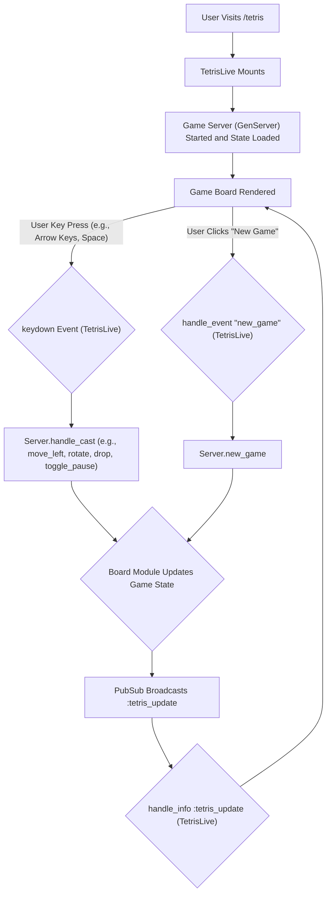

# TronTetris

## Executive Summary

TronTetris is a web-based Tetris game built with the Phoenix LiveView framework in Elixir. It aims to provide a classic Tetris experience with a "Tron-like" aesthetic. The game features standard Tetris mechanics including piece movement (left, right, drop), rotation, hard drop, line clearing, scoring, and level progression. Player authentication and leaderboards are also implemented. The project is currently in a playable state, with core game logic and user interface in place.

## Getting Started

To start your Phoenix server:

* Run `mix setup` to install and setup dependencies
* Start Phoenix endpoint with `mix phx.server` or inside IEx with `iex -S mix phx.server`

Now you can visit [`localhost:4000`](http://localhost:4000) from your browser.

Ready to run in production? Please [check our deployment guides](https://hexdocs.pm/phoenix/deployment.html).

## API Documentation

The application primarily uses Phoenix LiveView for real-time user interaction. Key LiveView routes are defined in `lib/tron_tetris_web/router.ex`:

* `/` or `/tetris`: Main game interface (`TronTetrisWeb.TetrisLive`).
* `/leaderboard`: Displays the game leaderboard (`TronTetrisWeb.LeaderboardLive`).
* `/login`: User login page (`TronTetrisWeb.Auth.LoginLive`).
* `/register`: User registration page (`TronTetrisWeb.Auth.RegisterLive`).

No traditional REST API endpoints are exposed for direct consumption as the game logic is handled via LiveView events and GenServers.

## Workflow Diagrams

### Game Logic Flow (Simplified)

### User Interaction Flow (LiveView)

## Learn more

* Official website: <https://www.phoenixframework.org/>
* Guides: <https://hexdocs.pm/phoenix/overview.html>
* Docs: <https://hexdocs.pm/phoenix>
* Forum: <https://elixirforum.com/c/phoenix-forum>
* Source: <https://github.com/phoenixframework/phoenix>
